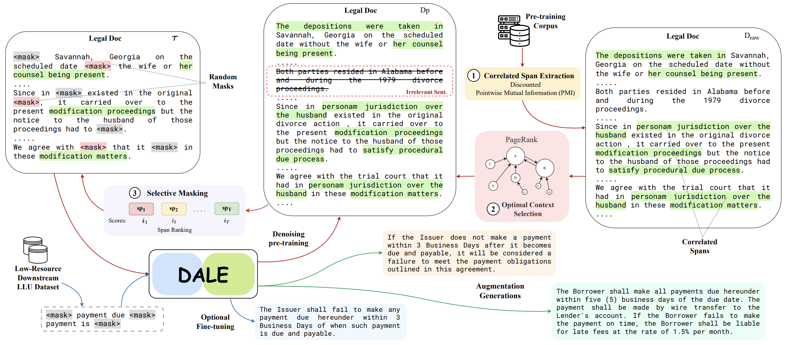

# DALE: Generative Data Augmentation for Low-Resource Legal NLP
Implementation of EMNLP 2023 paper: [DALE: Generative Data Augmentation for Low-Resource Legal NLP](https://arxiv.org/pdf/2310.15799.pdf).<br>



DALE pretrained bart-large model can be found [here](https://huggingface.co/ckevuru/DALE). Pretraing data can be found [here](https://drive.google.com/file/d/19Qwc08T4lAIOlX7uvEk9L9KwIU9lWZmw/view?usp=sharing).<br>

**Steps:**

1. Install dependencies using:
      ```
      pip install -r requirements.txt
      ```
2. Run the required files
      For pmi masking:
      ```
      cd pmi/
      sh pmi.sh <config_name> <dataset_path> <output_path> <n_gram_value> <pmi_cut_off>
      sh pmi.sh unfair_tos ./unfair_tos ./output_path 3 95
      ```

      For BART Pretraining:
      ```
      cd bart_pretrain/
      python pretrain.py --ckpt_path ./ckpt_path 
                        --dataset_path ./dataset_path> 
                        --max_input_length 1024 
                        --max_target_length 1024 
                        --batch_size 4
                        --num_train_epochs 10
                        --logging_steps 100
                        --save_steps 1000
                        --output_dir ./output_path
      ```

      For BART generation:
      ```
      cd bart_generation/
      python bart_ctx_augs.py --dataset_name "scotus" 
                        --path ./dataset_path 
                        --dest_path ./dest_path
                        --n_augs 5 
                        --batch_size 4
                        --model_path ./model_path

      bart_ctx_augs.py -> BART generation for multi-class data generation.
      bart_ctx_augs_multi.py -> BART generation for multi-label data generation.
      bart_ctx_augs_ch.py -> BART generation for casehold dataset.
      ```

### BibTeX entry and citation info
If you find our paper/code/demo useful, please cite our paper:
```
@inproceedings{ghosh-etal-2023-dale,
    title = "DALE: Generative Data Augmentation for Low-Resource Legal NLP",
    author = "Sreyan Ghosh  and
      Chandra Kiran Evuru  and
      Sonal Kumar  and
      S Ramaneswaran and
      S Sakshi and
      Utkarsh Tyagi and
      Dinesh Manocha",
    booktitle = "Proceedings of the 2023 Conference on Empirical Methods in Natural Language Processing",
    month = dec,
    year = "2023",
    address = "Sentosa, Singapore",
    abstract = "We present DALE, a novel and effective generative Data Augmentation framework for lowresource LEgal NLP. DALE addresses the challenges existing frameworks pose in generating effective data augmentations of legal documents - legal language, with its specialized vocabulary and complex semantics, morphology, and syntax, does not benefit from data augmentations that merely rephrase the source sentence. To address this, DALE, built on an EncoderDecoder Language Model, is pre-trained on a novel unsupervised text denoising objective based on selective masking - our masking strategy exploits the domain-specific language characteristics of templatized legal documents to mask collocated spans of text. Denoising these spans help DALE acquire knowledge about legal concepts, principles, and language usage. Consequently, it develops the ability to generate coherent and diverse augmentations with novel contexts. Finally, DALE performs conditional generation to generate synthetic augmentations for low-resource Legal NLP tasks. We demonstrate the effectiveness of DALE on 13 datasets spanning 6 tasks and 4 low-resource settings. DALE outperforms all our baselines, including LLMs, qualitatively and quantitatively, with improvements of 1%-50%."
}
```